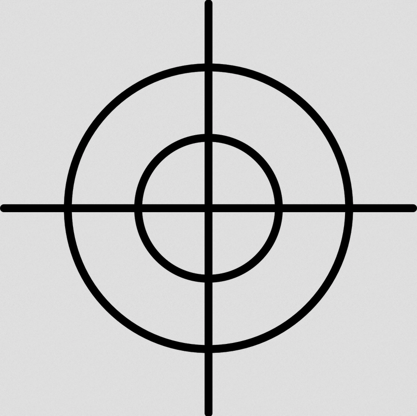
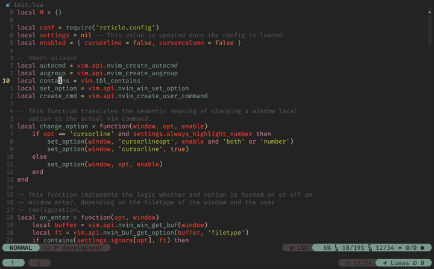

# reticle.nvim

<p align="center">
  
</p>

### :pencil: Description:

The `cursorline` setting makes it easy to locate the cursor position. However, when there are split windows, each one shows its cursorline, and there is no good indication of the currently active window.

This plugin avoids the clutter of multiple highlighted screen lines with split windows by disabling the `cursorline` and `cursorcolumn` settings for all but the current window. Unlike a simplistic solution with a few autocmds, this plugin still allows for exceptions like disabling the `cursorline` or `cursorcolumn` for a particular filetype or making it permanent for other filetypes. Furthermore, this plugin supports highlighting the (less intrusive) cursorline number in all split windows, while the cursorline is displayed only in the focused pane.

### 🎥 Preview:




### ✨ Features

- 🚶 Cursorline and / or cursorcolumn follow the focused window
- ♾️  Define filetypes that always show a cursorline and / or cursorcolumn
- 👀 Define filetypes that always show a cursorline and / or cursorcolumn when window is focused, regardless of the cursorline setting
- ❌ Define filetypes that never show a cursorline and / or cursorcolumn
- 🔦 Always highlight the cursorline number of all windows, regardless of the cursorline setting
- 💨 Written in LUA instead of vim script 


### ⚡️ Requirements

- Neovim >= 0.5.0


### 📦 Installation

Install the plugin with your favourite package manager and put this code
somewhere in your LUA configs:

```lua
require('reticle').setup {
    -- add options here if you want to overwrite defaults
}
```

Installing `reticle.nvim` with 📦 [packer](https://github.com/wbthomason/packer.nvim):

<details><summary>Click me</summary>

```lua
use {
    'tummetott/reticle.nvim',
    config = function()
        require('reticle').setup {
            -- add options here if you want to overwrite defaults
        }
    end
}
```

</details>

Installing `reticle.nvim` with 💤 [lazy](https://github.com/folke/lazy.nvim):

<details><summary>Click me</summary>

```lua
require('lazy').setup {
    {
        'tummetott/reticle.nvim',
        event = 'VeryLazy', -- lazyload the plugin if you like
        opts = {
            -- add options here if you want to overwrite defaults
        },
    },
}
```

</details>


### 🚀 Usage

Change the global options `cursorline` and `cursorcolumn` to your needs in your
lua config or define keymaps in order to change them dynamically.

In LUA:
```lua
vim.opt.cursorline = true
vim.opt.cursorcolumn = true
```

As EX command:
```
:set [no]cursorline
:set [no]cursorcolumn
```

<details><summary>Example keymappings</summary>


Define the following keymaps or use a plugin like [unimpaired.nvim](https://github.com/Tummetott/unimpaired.nvim).

```lua
-- Enable the cursorline
vim.keymap.set(
    'n',
    '[oc',
    function() vim.opt.cursorline = true end,
    { desc = 'Enable the cursorline' }
)

-- Disable the cursorline
vim.keymap.set(
    'n',
    ']oc',
    function() vim.opt.cursorline = false end,
    { desc = 'Disable the cursorline' }
)

-- Use the toggle_cursorline() function for toggeling. See 'Known Issues'
vim.keymap.set(
    'n',
    'yoc',
    function() require'reticle'.toggle_cursorline() end,
    { desc = 'Toggle the cursorline' }
)

-- Enable the cursorcolumn
vim.keymap.set(
    'n',
    '[ou',
    function() vim.opt.cursorcolumn = true end,
    { desc = 'Enable the cursorcolumn' }
)

-- Disable the cursorcolumn
vim.keymap.set(
    'n',
    ']ou',
    function() vim.opt.cursorcolumn = false end,
    { desc = 'Disable the cursorcolumn' }
)

-- Toggle the cursorcolumn
vim.keymap.set(
    'n',
    'you',
    function() vim.opt.cursorcolumn = not vim.opt.cursorcolumn end,
    { desc = 'Toggle the cursorcolumn' }
)
```

</details>

### ⚙️  Configuration

The `setup()` function takes a dictionary with user configurations. If you don't
want to customize the default behaviour, you can leave it empty.

Customizing examples:

```lua
require('reticle').setup {
    -- Make the cursorline and cursorcolumn follow your active window. This
    -- only works if the cursorline and cursorcolumn setting is switched on
    -- globaly like explained in 'Usage'. Default is true for both values
    follow = {
        cursorline = true,
        cursorcolumn = true,
    },

    -- Disable the cursorline and cursorcolumn in insert mode. Default is true
    disable_in_insert = false

    -- By default, nvim highlights the cursorline number only when the cursorline setting is
    -- switched on. When enabeling the following setting, the cursorline number
    -- of every window is always highlighted, regardless of the setting
    always_highlight_number = true,

    -- Define filetypes where the cursorline / cursorcolumn is always on,
    -- regardless of the global setting
    always = {
        cursorline = {
            'json',
        },
        cursorcolumn = {},
    },

    -- Define filetypes where the cursorline / cursorcolumn is always on when
    -- the window is focused, regardless of the global setting
    on_focus = {
        cursorline = {
            'help',
            'NvimTree',
        },
        cursorcolumn = {},
    },

    -- Define filetypes where the cursorline / cursorcolumn is never on,
    -- regardless of the global setting
    never = {
        cursorline = {
            'qf',
        },
        cursorcolumn = {
            'qf',
        },
    },

    -- Define filetypes which are ignored by the plugin
    ignore = {
        cursorline = {
            'lspinfo',
        },
        cursorcolumn = {
            'lspinfo',
        },
    },
}
```

#### Default Configuration
The default configuration of `reticle.nvim` looks as following:

<details><summary>Default config</summary>

```lua
{
    follow = {
        cursorline = true,
        cursorcolumn = true,
    },
    disable_in_insert = true,
    always_highlight_number = false,
    always = {
        cursorline = {},
        cursorcolumn = {},
    },
    on_focus = {
        cursorline = {},
        cursorcolumn = {},
    },
    never = {
        cursorline = {
            'TelescopePrompt',
            'DressingInput',
        },
        cursorcolumn = {},
    },
    ignore = {
        cursorline = {},
        cursorcolumn = {},
    },
}
```

</details>

#### Change highlight groups

Change the `CursorLine`, `CursorColumn` and `CursorLineNr` hl-group as usual:

With EX command:

```
-- Set color explicitly by defining a RGB value
:highlight CursorLine guibg=#3C3836

-- Link to other hl-group
:highlight! link CursorLine Visual
```

Or with LUA command:

```lua
-- Set color explicitly by defining a RGB value
vim.api.nvim_set_hl(0, 'CursorLineNr', { fg = '#FFFFFF' })

-- Link to other hl-group
vim.api.nvim_set_hl(0, 'CursorLine', { link = 'Visual' })

-- Underline the cursorline
vim.api.nvim_set_hl(0, 'CursorLine', { underline = true })
```

### 🐛 Known Issues:

- It is not possible to toggle the cursorline with `set cursorline!`, `set
  invcursorline` or `lua vim.opt.cursorline = not vim.opt.cursorline`, when the
  option `always_show_cl_number` is enabled. Use instead:
  ```lua
  require('reticle').toggle_cursorline()
  ```
- It is important to use `set` or `lua vim.opt` like explanied in 'Usage'. The
  plugin will not pick up the new setting when using `setlocal` or
  `lua vim.opt_local`.


### 👯 Similar Plugins:

- [vim-CursorLineCurrentWindow](https://github.com/inkarkat/vim-CursorLineCurrentWindow)
- [vim-crosshair](https://github.com/bronson/vim-crosshairs)


### ⚠️  Caveats:

I wrote this plugin basically for myself, but then decided to share it. It is
extensively tested, but there may still be bugs in the code. Pull requests are
welcome if you want to add more features.

x Tummetott
